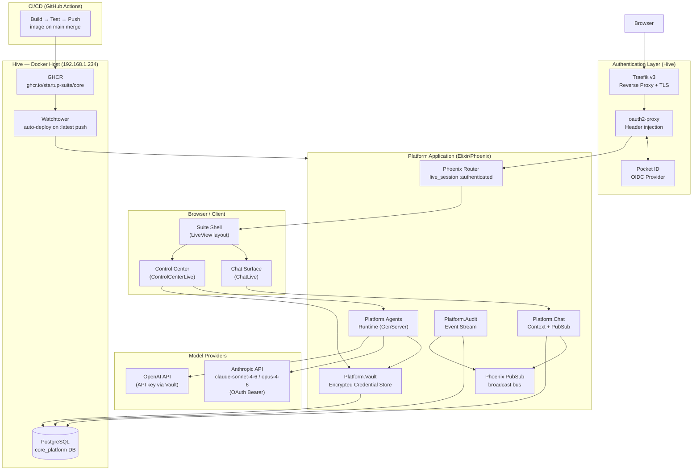

# System Overview

Top-level component map of Startup Suite Core — all platforms, runtimes, and external integrations.

```mermaid
graph TB
  subgraph Client["Browser / Client"]
    Shell["Suite Shell<br/>(LiveView layout)"]
    Chat["Chat Surface<br/>(ChatLive)"]
    Control["Control Center<br/>(ControlCenterLive)"]
  end

  subgraph Auth["Authentication Layer (Hive)"]
    Traefik["Traefik v3<br/>Reverse Proxy + TLS"]
    OAuthProxy["oauth2-proxy<br/>Header injection"]
    PocketID["Pocket ID<br/>OIDC Provider"]
  end

  subgraph Platform["Platform Application (Elixir/Phoenix)"]
    Router["Phoenix Router<br/>live_session :authenticated"]
    Vault["Platform.Vault<br/>Encrypted Credential Store"]
    Agents["Platform.Agents<br/>Runtime (GenServer)"]
    ChatCtx["Platform.Chat<br/>Context + PubSub"]
    Audit["Platform.Audit<br/>Event Stream"]
    PubSub["Phoenix PubSub<br/>broadcast bus"]
  end

  subgraph Providers["Model Providers"]
    Anthropic["Anthropic API<br/>claude-sonnet-4-6 / opus-4-6<br/>(OAuth Bearer)"]
    OpenAI["OpenAI API<br/>(API key via Vault)"]
  end

  subgraph Hive["Hive — Docker Host (192.168.1.234)"]
    Postgres[("PostgreSQL<br/>core_platform DB")]
    Watchtower["Watchtower<br/>auto-deploy on :latest push"]
    GHCR["GHCR<br/>ghcr.io/startup-suite/core"]
  end

  subgraph CI["CI/CD (GitHub Actions)"]
    GHActions["Build → Test → Push<br/>image on main merge"]
  end

  Browser["Browser"] --> Traefik
  Traefik --> OAuthProxy
  OAuthProxy <--> PocketID
  OAuthProxy --> Router
  Router --> Shell
  Shell --> Chat & Control
  Chat --> ChatCtx
  Control --> Agents & Vault
  ChatCtx --> PubSub
  ChatCtx --> Postgres
  Agents --> Vault
  Agents --> Anthropic & OpenAI
  Vault --> Postgres
  Audit --> Postgres
  Audit --> PubSub
  GHActions --> GHCR
  GHCR --> Watchtower
  Watchtower --> Platform
```
