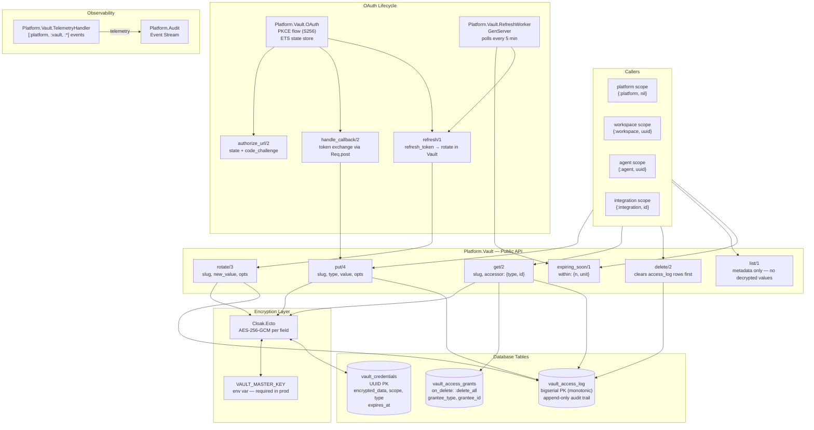

# Vault Architecture — ADR 0006

Secure Credential Vault: encrypted storage, scoped access control, append-only audit log, and OAuth lifecycle management.

## Credential Types
| Type | Usage |
|------|-------|
| `api_key` | Static API keys (GitHub PAT, etc.) |
| `oauth2` | OAuth tokens (access + refresh JSON) |
| `token` | Bearer tokens |
| `keypair` | Public/private key material |
| `custom` | Arbitrary encrypted blobs |

## Scope Hierarchy
`platform` → `workspace` → `agent` → `integration`

- A `platform`-scoped credential is readable by any accessor.
- An `agent`-scoped credential is only readable by that specific agent UUID.
- `vault_access_grants` override the default scope rules for explicit sharing.
