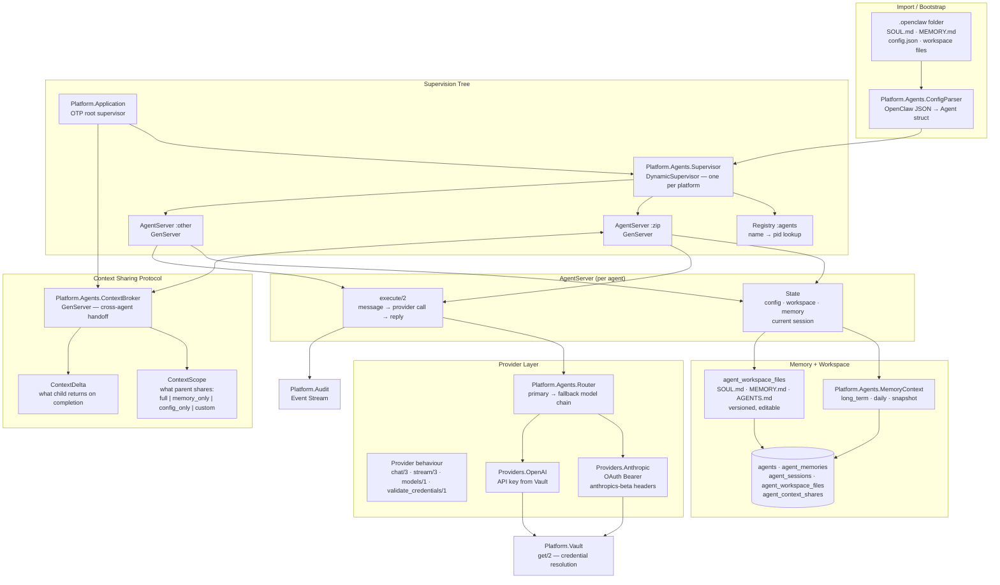

# Agent Runtime Architecture — ADR 0007

GenServer-per-agent under DynamicSupervisor, context sharing protocol, provider behaviour with Vault-backed credential resolution.

## Key Design Decisions

| Decision | Rationale |
|----------|-----------|
| GenServer per agent | Process isolation — one crash doesn't affect others |
| DynamicSupervisor | Agents start/stop at runtime without restarting app |
| Registry for lookup | O(1) pid resolution by agent slug |
| ContextBroker GenServer | Serializes cross-agent context handoffs, prevents races |
| Provider behaviour | Swap Anthropic/OpenAI without changing agent code |
| Vault for all credentials | No hardcoded keys; rotation without redeploy |
| `.openclaw` portability | Import/Export preserves agent identity across deployments |
