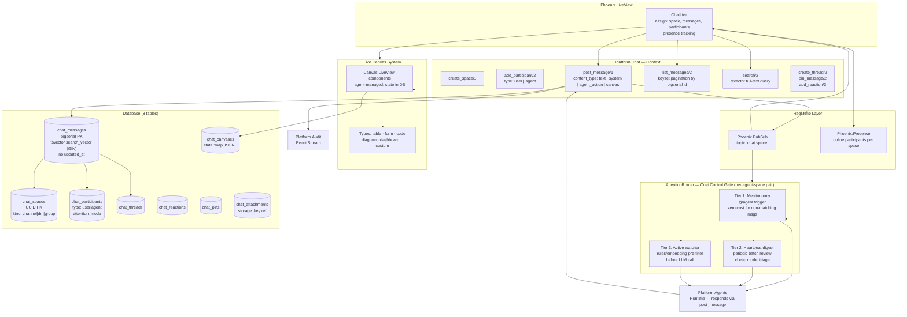
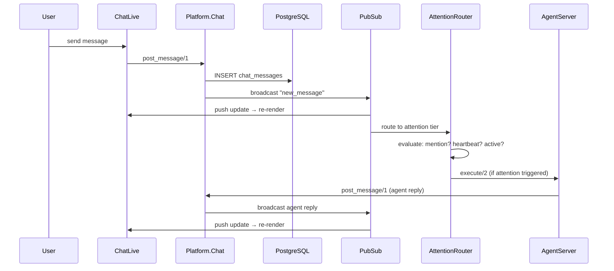

# Chat Backend Architecture — ADR 0008

Real-time work chat with native AI agent participation, three-tier attention routing for cost control, and live canvas components.

## Message Flow

## Attention Tier Decision

| Tier | Trigger | Cost | v1 |
|------|---------|------|----|
| 1: Mention-only | `@agent` in content | zero for non-matches | ✅ |
| 2: Heartbeat digest | periodic interval | cheap model triage | planned |
| 3: Active watcher | all messages | pre-filter + LLM | future |
