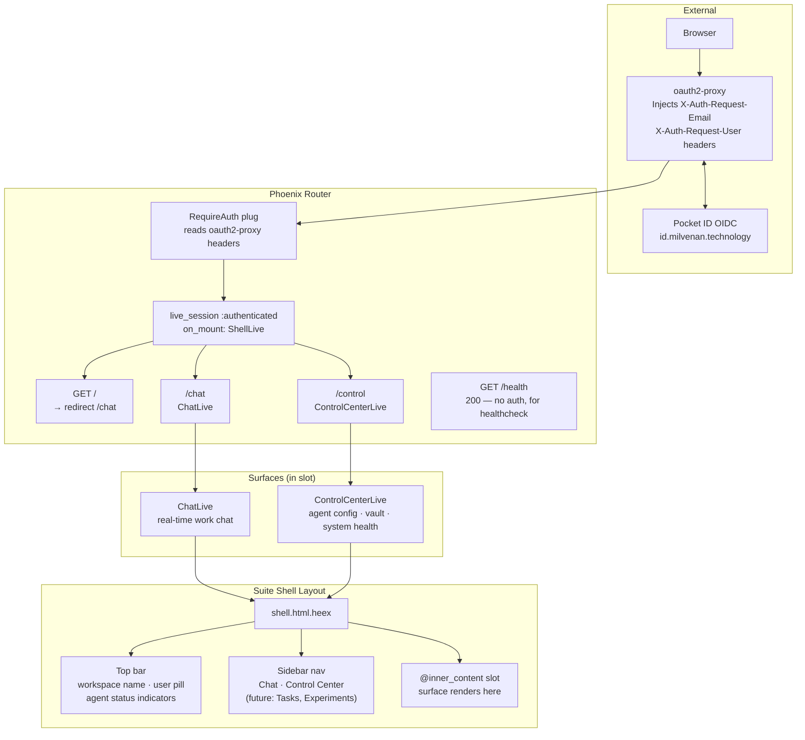
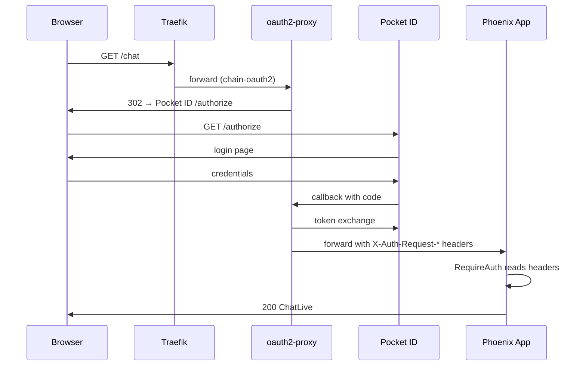

# Suite Shell Architecture — ADR 0009

Persistent navigation shell wrapping all LiveView surfaces. Auth-gated live_session, sidebar nav, top bar, slot-based content rendering.

## Route Table

| Path | Module | Auth | Notes |
|------|--------|------|-------|
| `/` | — | ✅ | Redirects to `/chat` |
| `/chat` | `ChatLive` | ✅ | Main work chat surface |
| `/control` | `ControlCenterLive` | ✅ | Agent/vault/system config |
| `/health` | controller | ❌ | Healthcheck endpoint |
| `/auth/*` | `AuthController` | ❌ | OIDC callback routes |

## Auth Flow

## Shell Extension Pattern

New surfaces slot into the shell by:
1. Adding a route inside `live_session :authenticated`
2. Adding a nav entry in `shell.html.heex` sidebar
3. Using the shell layout (inherited automatically from live_session)

No shell modifications needed for the surface itself — the `@inner_content` slot handles rendering.
