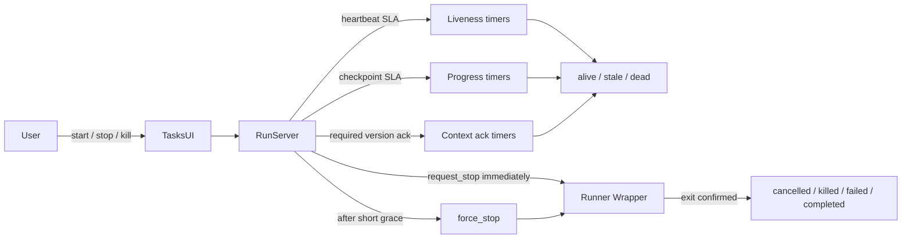
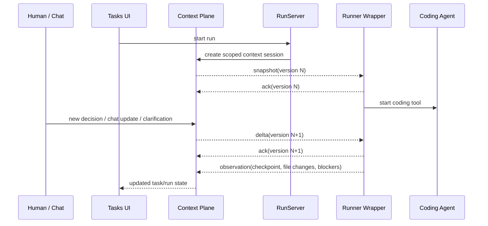
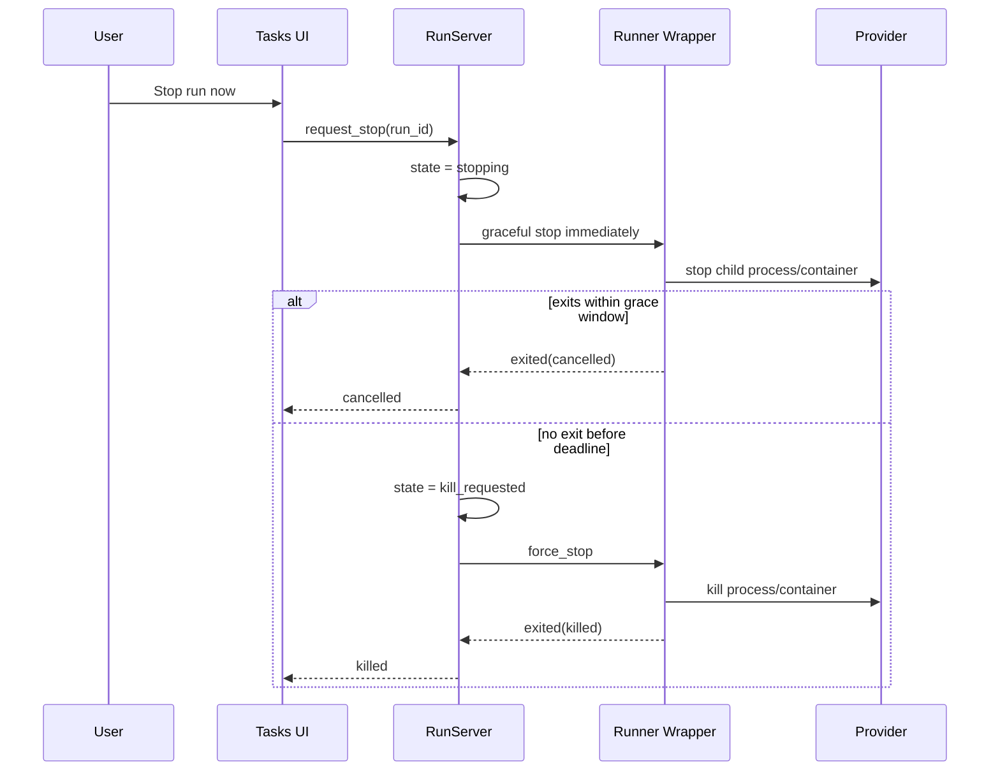

# Execution Runners, Context Plane, and Run Control — ADR 0011

Tasks is the user-facing surface. Execution is the platform domain underneath it. The control plane stays in BEAM/Elixir; real work happens in isolated runners with live context access and deterministic stop/kill control.

```mermaid
graph TB
  subgraph UI["User-Facing Surfaces"]
    TasksUI["Tasks Surface<br/>run list · task detail · stop/kill controls"]
    AgentResources["Agent Resources<br/>vault · agent config · runtime health"]
    Chat["Chat / Canvas<br/>human-agent collaboration"]
  end

  subgraph Phoenix["Platform Application (Elixir/Phoenix)"]
    Router["Phoenix Router / LiveView"]
    Execution["Platform.Execution"]
    RunServer["RunServer<br/>one OTP process per run"]
    ContextPlane["Context Plane<br/>reducers · scoped views · versioning"]
    Artifacts["Artifacts / Destinations<br/>publish code, files, canvases"]
    Vault["Vault<br/>leased run credentials"]
    Audit["Audit Event Stream"]
    PubSub["Phoenix PubSub"]
    ETS["ETS Hot Context Cache"]
  end

  subgraph State["Durable State"]
    Postgres[("Postgres<br/>runs · events · context records"])
  end

  subgraph Providers["Execution Providers"]
    LocalProvider["Local Runner Provider<br/>spawn OS process"]
    DockerProvider["Docker Runner Provider"]
    Runnerd["suite-runnerd<br/>companion control service"]
  end

  subgraph Workers["Execution Workers"]
    LocalWrapper["Runner Wrapper<br/>local process"]
    DockerWrapper["Runner Wrapper<br/>ephemeral container"]
    CodingAgent["Codex / Claude Code / other tool"]
  end

  subgraph Outputs["Publication Targets"]
    GitHub["GitHub<br/>branch / PR"]
    Registry["Docker Registry"]
    Drive["Google Drive"]
    Preview["Ephemeral Preview Route<br/>(future experiments)"]
  end

  TasksUI --> Router
  AgentResources --> Router
  Chat --> Router

  Router --> Execution
  Execution --> RunServer
  Execution --> ContextPlane
  Execution --> Artifacts
  Execution --> Vault
  Execution --> Audit
  ContextPlane --> ETS
  ContextPlane --> Postgres
  Artifacts --> Postgres
  Audit --> Postgres
  Audit --> PubSub
  ContextPlane --> PubSub

  RunServer --> LocalProvider
  RunServer --> DockerProvider
  DockerProvider --> Runnerd
  LocalProvider --> LocalWrapper
  Runnerd --> DockerWrapper
  LocalWrapper --> CodingAgent
  DockerWrapper --> CodingAgent

  LocalWrapper --> ContextPlane
  DockerWrapper --> ContextPlane
  LocalWrapper --> Vault
  DockerWrapper --> Vault
  LocalWrapper --> Audit
  DockerWrapper --> Audit

  Artifacts --> GitHub
  Artifacts --> Registry
  Artifacts --> Drive
  Artifacts --> Preview
```

## Control Model



## Context Flow



## Fast Stop / Kill Sequence



## UI Implications

The Tasks surface needs a first-class operator UI, not just a kanban board.

Minimum UI responsibilities implied by ADR 0011:

- task detail with plan + current run state
- live run timeline (phase, checkpoint, last heartbeat, last progress)
- context summary and "what changed" view
- explicit stop / kill controls
- artifact list and publication status
- runner profile visibility (`local` vs `docker`)
- future experiment hooks (preview route, variant, TTL)

## Notes

- Runners are **context plane clients**, not trusted BEAM nodes
- ETS is the hot cache, not the distributed contract
- Docker installs use `suite-runnerd` as the companion service for spawning/killing containers
- The same artifact/destination system should support task outputs and chat/canvas outputs

## Downstream Handoff

### Provider contract reminders

- `spawn_run` should return a provider ref the control plane can persist and later hand back to provider adapters.
- `request_stop` should be immediate and optimistic; the control plane starts the grace timer regardless of whether the provider reports success synchronously.
- `force_stop` should be idempotent and should confirm exit explicitly whenever possible so `RunServer` can land on `killed` instead of timing out to `dead`.
- Provider wrappers own emitting heartbeats, checkpoints, context acks, and exit notifications.

### Tasks UI reminders

- Run detail should subscribe to the BEAM-owned run state, not derive health from raw logs.
- Show `stale` and `dead` as distinct failure modes.
- Make the quick stop action visible immediately, but preserve a separate hard-kill affordance for operators.
- Future local/docker surfaces should reuse the same stop/kill timeline and run state labels.
