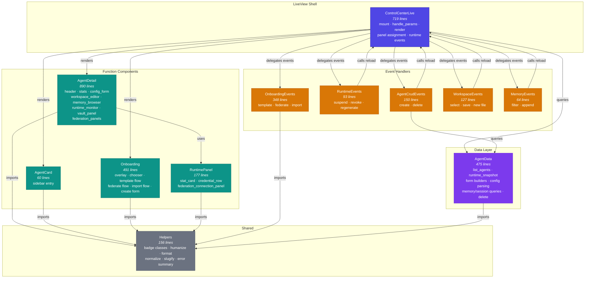
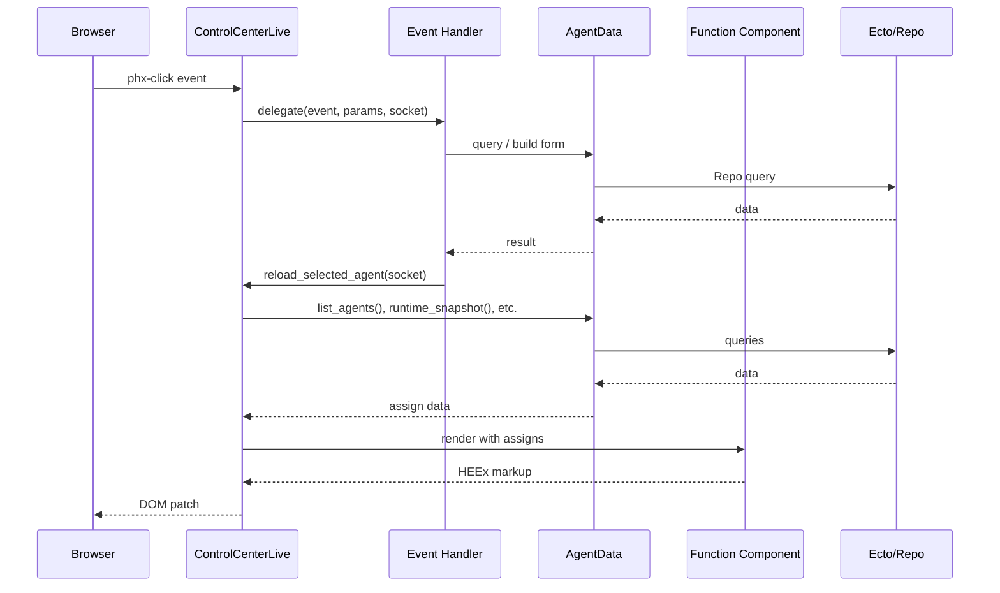

# Control Center Module Architecture

Module dependency diagram for the modularized `ControlCenterLive` (ADR 0016).

## Module Dependency Graph

## Layer Responsibilities

| Layer | Modules | Role |
|-------|---------|------|
| **Shell** | `ControlCenterLive` | LiveView lifecycle, socket assigns, URL routing, `render/1` composition |
| **Components** | `AgentCard`, `AgentDetail`, `Onboarding`, `RuntimePanel` | Pure HEEx rendering via `Phoenix.Component`. No state, no side effects. |
| **Event Handlers** | `OnboardingEvents`, `RuntimeEvents`, `AgentCrudEvents`, `WorkspaceEvents`, `MemoryEvents` | Grouped `handle_event` clauses. Return `{:noreply, socket}`. May call back to shell for reload. |
| **Data** | `AgentData` | Queries, form builders, config parsing, deletion. No socket access. |
| **Shared** | `Helpers` | Badge classes, formatting, normalization. Imported by all layers. |

## Data Flow

