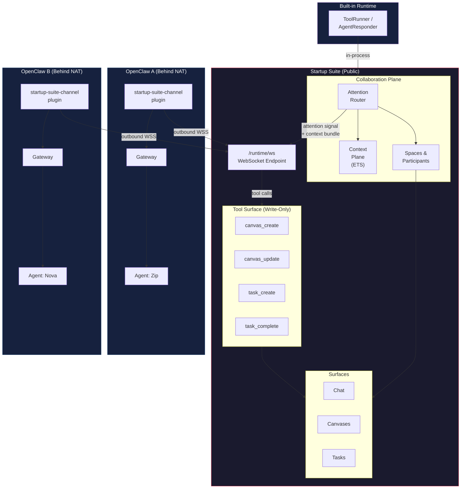
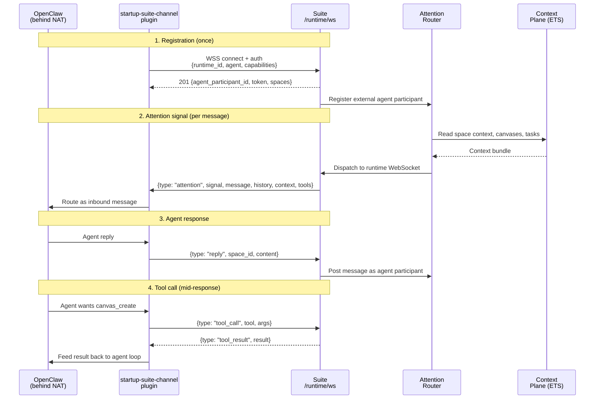
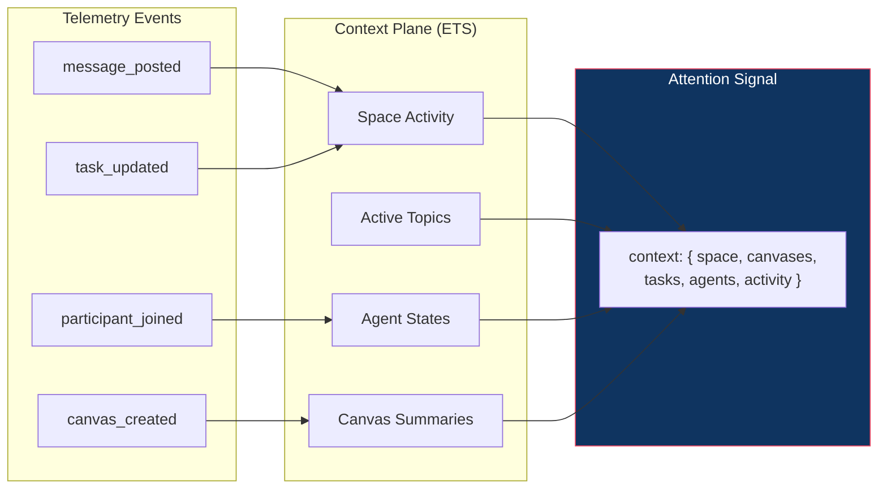
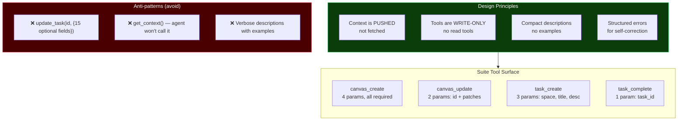

# Agent Federation Architecture

## System Overview

```mermaid
graph TB
    subgraph suite["Startup Suite (Public)"]
        direction TB
        ws_endpoint["/runtime/ws<br>WebSocket Endpoint"]
        
        subgraph collab["Collaboration Plane"]
            direction LR
            ar["Attention<br>Router"]
            cp["Context<br>Plane<br>(ETS)"]
            spaces["Spaces &<br>Participants"]
        end
        
        subgraph surfaces["Surfaces"]
            direction LR
            chat["Chat"]
            canvases["Canvases"]
            tasks["Tasks"]
        end
        
        subgraph tools_surface["Tool Surface (Write-Only)"]
            direction LR
            t1["canvas_create"]
            t2["canvas_update"]
            t3["task_create"]
            t4["task_complete"]
        end
        
        ar --> cp
        ar --> spaces
        spaces --> surfaces
    end
    
    subgraph oc_a["OpenClaw A (Behind NAT)"]
        direction TB
        gw_a["Gateway"]
        agent_a["Agent: Zip"]
        plugin_a["startup-suite-channel<br>plugin"]
        
        plugin_a --> gw_a
        gw_a --> agent_a
    end
    
    subgraph oc_b["OpenClaw B (Behind NAT)"]
        direction TB
        gw_b["Gateway"]
        agent_b["Agent: Nova"]
        plugin_b["startup-suite-channel<br>plugin"]
        
        plugin_b --> gw_b
        gw_b --> agent_b
    end
    
    subgraph oc_c["Built-in Runtime"]
        direction TB
        builtin["ToolRunner /<br>AgentResponder"]
    end
    
    plugin_a -- "outbound WSS" --> ws_endpoint
    plugin_b -- "outbound WSS" --> ws_endpoint
    builtin -- "in-process" --> collab
    
    ar -- "attention signal<br>+ context bundle" --> ws_endpoint
    ws_endpoint -- "tool calls" --> tools_surface
    tools_surface --> surfaces

    style suite fill:#1a1a2e,stroke:#e94560,color:#fff
    style oc_a fill:#16213e,stroke:#0f3460,color:#fff
    style oc_b fill:#16213e,stroke:#0f3460,color:#fff
    style oc_c fill:#16213e,stroke:#533483,color:#fff
```

## Connection Flow

```mermaid
sequenceDiagram
    participant OC as OpenClaw<br>(behind NAT)
    participant Plugin as startup-suite-channel<br>plugin
    participant Suite as Suite<br>/runtime/ws
    participant AR as Attention<br>Router
    participant CP as Context<br>Plane (ETS)

    Note over OC,Suite: 1. Registration (once)
    Plugin->>Suite: WSS connect + auth<br>{runtime_id, agent, capabilities}
    Suite-->>Plugin: 201 {agent_participant_id, token, spaces}
    Suite->>AR: Register external agent participant

    Note over OC,Suite: 2. Attention signal (per message)
    AR->>CP: Read space context, canvases, tasks
    CP-->>AR: Context bundle
    AR->>Suite: Dispatch to runtime WebSocket
    Suite->>Plugin: {type: "attention", signal, message, history, context, tools}
    Plugin->>OC: Route as inbound message

    Note over OC,Suite: 3. Agent response
    OC->>Plugin: Agent reply
    Plugin->>Suite: {type: "reply", space_id, content}
    Suite->>AR: Post message as agent participant

    Note over OC,Suite: 4. Tool call (mid-response)
    OC->>Plugin: Agent wants canvas_create
    Plugin->>Suite: {type: "tool_call", tool, args}
    Suite-->>Plugin: {type: "tool_result", result}
    Plugin->>OC: Feed result back to agent loop
```

## Context Injection

```mermaid
flowchart LR
    subgraph telemetry["Telemetry Events"]
        msg["message_posted"]
        canvas["canvas_created"]
        task["task_updated"]
        join["participant_joined"]
    end

    subgraph ets["Context Plane (ETS)"]
        activity["Space Activity"]
        topics["Active Topics"]
        states["Agent States"]
        summaries["Canvas Summaries"]
    end

    subgraph signal["Attention Signal"]
        context["context: { space, canvases,<br>tasks, agents, activity }"]
    end

    msg --> activity
    canvas --> summaries
    task --> activity
    join --> states

    activity --> context
    topics --> context
    states --> context
    summaries --> context

    style signal fill:#0f3460,stroke:#e94560,color:#fff
```

## Tool Design

```mermaid
flowchart TB
    subgraph principle["Design Principles"]
        direction TB
        p1["Context is PUSHED<br>not fetched"]
        p2["Tools are WRITE-ONLY<br>no read tools"]
        p3["Compact descriptions<br>no examples"]
        p4["Structured errors<br>for self-correction"]
    end

    subgraph tools["Suite Tool Surface"]
        direction TB
        cc["canvas_create<br>4 params, all required"]
        cu["canvas_update<br>2 params: id + patches"]
        tc["task_create<br>3 params: space, title, desc"]
        td["task_complete<br>1 param: task_id"]
    end

    subgraph anti["Anti-patterns (avoid)"]
        direction TB
        a1["❌ update_task(id, {15 optional fields})"]
        a2["❌ get_context() — agent won't call it"]
        a3["❌ Verbose descriptions with examples"]
    end

    principle --> tools
    
    style anti fill:#4a0000,stroke:#e94560,color:#fff
    style principle fill:#0a3d0a,stroke:#4ade80,color:#fff
```
